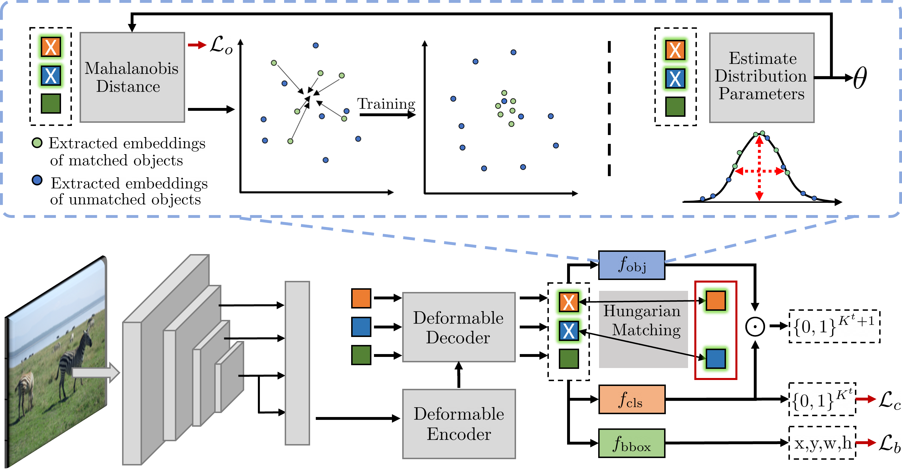

# PROB: Probabilistic Objectness for Open World Object Detection 

[`Paper`](https://arxiv.org/abs/2212.01424) 

#### [Orr Zohar](https://orrzohar.github.io/), [Jackson Wang](https://wangkua1.github.io/), [Serena Yeung](https://marvl.stanford.edu/people.html)

# Abstract

Open World Object Detection (OWOD) is a new and challenging computer vision task that bridges the gap between classic object detection (OD) benchmarks and object detection in the real world.
In addition to detecting and classifying *seen/labeled* objects, OWOD algorithms are expected to detect *novel/unknown* objects - which can be classified and incrementally learned.
In standard OD, object proposals not overlapping with a labeled object are automatically classified as background. Therefore, simply applying OD methods to OWOD fails as unknown objects would be predicted as background. 
The challenge of detecting unknown objects stems from the lack of supervision in distinguishing unknown objects and background object proposals. Previous OWOD methods have attempted to overcome this issue by generating supervision using pseudo-labeling - however, unknown object detection has remained low.
Probabilistic/generative models may provide a solution for this challenge. 
Herein, we introduce a novel probabilistic framework for objectness estimation, where we alternate between probability distribution estimation and objectness likelihood maximization of known objects in the embedded feature space - ultimately allowing us to estimate the objectness probability of different proposals. 
The resulting **Pr**obabilistic **Ob**jectness transformer-based open-world detector, PROB, integrates our framework into traditional object detection models, adapting them for the open-world setting.
Comprehensive experiments on OWOD benchmarks show that PROB outperforms all existing OWOD methods in both unknown object detection (~2x unknown recall) and known object detection (~10% mAP).


# Overview
PROB adapts the Deformable DETR model by adding the proposed 'probabalistic objectness' head. In training, we alterante 
between distribution estimation (top right) and objectness likelihood maximization of **matched ground-truth objects** 
(top left). For interence, the objectness probability multiplies the classification probabilities. For more, see the manuscript.



# Results
<table align="center">
    <tr>
        <th> </th>
        <th align="center" colspan=2>Task1</th>
        <th align="center" colspan=2>Task2</th>
        <th align="center" colspan=2>Task3</th>
        <th align="center" colspan=1>Task4</th>
    </tr>
    <tr>
        <td align="left">Method</td>
        <td align="center">U-Recall</td>
        <td align="center">mAP</td>
        <td align="center">U-Recall</td>
        <td align="center">mAP</td>
        <td align="center">U-Recall</td>
        <td align="center">mAP</td>
        <td align="center">mAP</td>
    </tr>
    <tr>
        <td align="left">OW-DETR</td>
        <td align="center">7.5</td>
        <td align="center">59.2</td>
        <td align="center">6.2</td>
        <td align="center">42.9</td>
        <td align="center">5.7</td>
        <td align="center">30.8</td>
        <td align="center">27.8</td>
    </tr>
    <tr>
        <td align="left">PROB</td>
        <td align="center">19.4</td>
        <td align="center">59.5</td>
        <td align="center">17.4</td>
        <td align="center">44.0</td>
        <td align="center">19.6</td>
        <td align="center">36.0</td>
        <td align="center">31.5</td>
    </tr>
</table>


# Installation

### Requirements

We have trained and tested our models on `Ubuntu 16.04`, `CUDA 11.3`, `GCC 5.4`, `Python 3.10.4`

```bash
conda env create -n prob --file env.yml
conda activate prob
```

### Backbone features

Download the self-supervised backbone from [here](https://dl.fbaipublicfiles.com/dino/dino_resnet50_pretrain/dino_resnet50_pretrain.pth) and add in `models` folder.

### Compiling CUDA operators
```bash
cd ./models/ops
sh ./make.sh
# unit test (should see all checking is True)
python test.py
```


## Data Structure

```
PROB/
└── data/
    └── OWOD/
        ├── JPEGImages
        ├── Annotations
        └── ImageSets
            ├── OWDETR
            ├── TOWOD
            └── VOC2007
```

### Dataset Preparation

The splits are present inside `data/OWOD/ImageSets/` folder.
1. Download the COCO Images and Annotations from [coco dataset](https://cocodataset.org/#download) into the `data/` directory.
2. Unzip train2017 and val2017 folder. The current directory structure should look like:
```
PROB/
└── data/
    └── coco/
        ├── annotations/
        ├── train2017/
        └── val2017/
```
4. Move all images from `train2017/` and `val2017/` to `JPEGImages` folder.
5. Use the code `coco2voc.py` for converting json annotations to xml files.
6. Download the PASCAL VOC 2007 & 2012 Images and Annotations from [pascal dataset](http://host.robots.ox.ac.uk/pascal/VOC/) into the `data/` directory.
7. untar the trainval 2007 and 2012 and test 2007 folders.
8. Move all the images to `JPEGImages` folder and annotations to `Annotations` folder. 

Currently, we follow the VOC format for data loading and evaluation

# Training

#### Training on single node

To train PROB on a single node with 4 GPUS, run
```bash
bash ./run.sh
```

By editing the run.sh file, you can decide to run each one of the configurations defined in ``\configs``:

1. EVAL_M_OWOD_BENCHMARK.sh - evaluation of tasks 1-4 on the MOWOD Benchmark.
2. EVAL_S_OWOD_BENCHMARK.sh - evaluation of tasks 1-4 on the SOWOD Benchmark. 
3. M_OWOD_BENCHMARK.sh - training for tasks 1-4 on the MOWOD Benchmark.
4. M_OWOD_BENCHMARK_RANDOM_IL.sh - training for tasks 1-4 on the MOWOD Benchmark with random exemplar selection.
5. S_OWOD_BENCHMARK.sh - training for tasks 1-4 on the SOWOD Benchmark.

#### Training on slurm cluster

To train PROB on a slurm cluster having 2 nodes with 8 GPUS each (not tested), run
```bash
bash run_slurm.sh
```


# Evaluation & Result Reproduction

For reproducing any of the aforementioned results, please download our [pretrain weights](https://drive.google.com/uc?id=1TbSbpeWxRp1SGcp660n-35sd8F8xVBSq) and place them in the 
'exps' directory. run the `run_eval.sh` file to utilize multiple GPUs.

```
PROB/
└── exps/
    ├── MOWODB/
    |   └── PROB/ (t1.ph - t4.ph)
    └── SOWODB/
        └── PROB/ (t1.ph - t4.ph)
```


**Note:**
For more training and evaluation details please check the [Deformable DETR](https://github.com/fundamentalvision/Deformable-DETR) reposistory.


# Citation

If you use PROB, please consider citing:

```
@misc{zohar2022prob,
  author = {Zohar, Orr and Wang, Kuan-Chieh and Yeung, Serena},
  title = {PROB: Probabilistic Objectness for Open World Object Detection},
  publisher = {arXiv},
  year = {2022}
}
```

# Contact

Should you have any question, please contact :e-mail: orrzohar@stanford.edu

**Acknowledgments:**

PROB builds on previous works' code base such as [OW-DETR](https://github.com/akshitac8/OW-DETR), [Deformable DETR](https://github.com/fundamentalvision/Deformable-DETR), [Detreg](https://github.com/amirbar/DETReg), and [OWOD](https://github.com/JosephKJ/OWOD). If you found PROB useful please consider citing these works as well.

